# TP6 : Création d'une API REST/GraphQL

## 11. Tester les opérations GraphQL avec Postman, Insomnia ou toute interface GraphQL compatible HTTP : 
 GET users 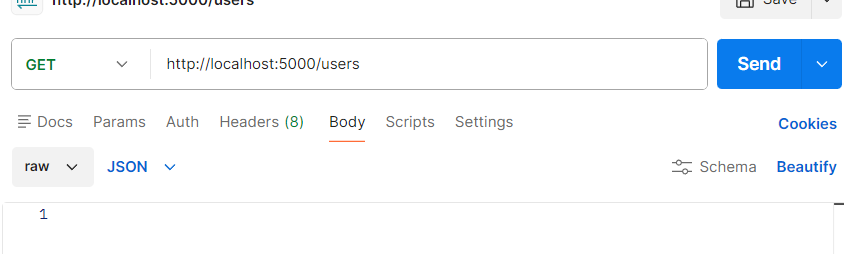

 result : 
 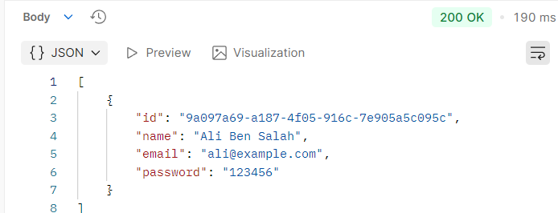

GET users/:id
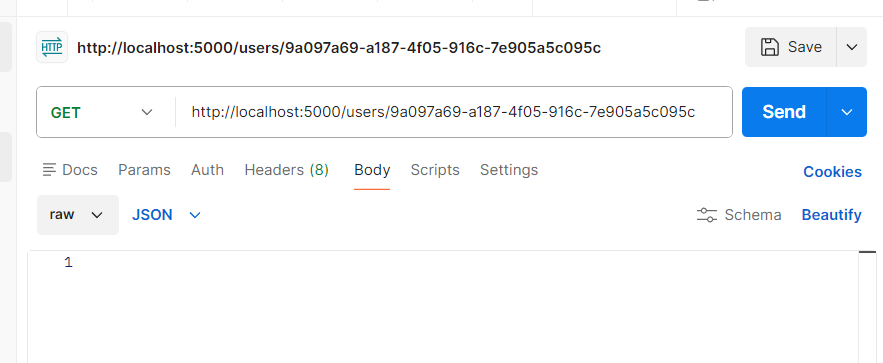
result:
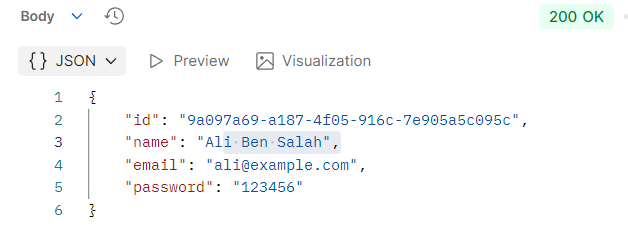

PUT 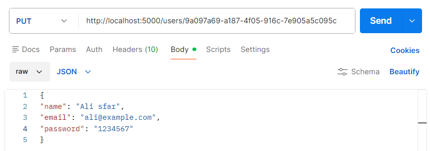

result: 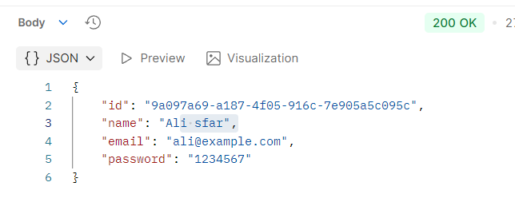

DELETE /users/<id>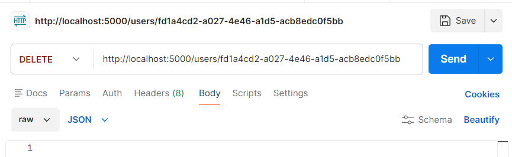

result: 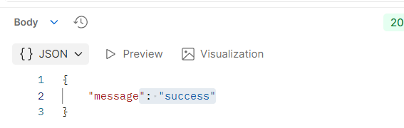

## Créer au moins deux utilisateurs avec REST, puis vérifier leur présence avec GraphQL. :
graphql  user 1: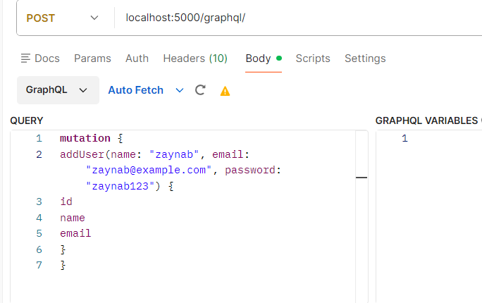  
user2 : 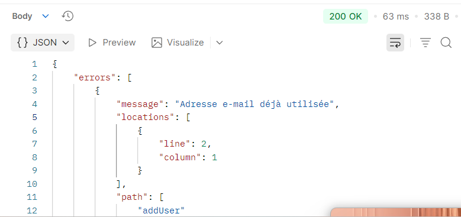
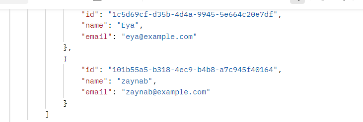

## Créer au moins un utilisateur avec GraphQL, puis vérifier sa présence avec REST. :
REST: 
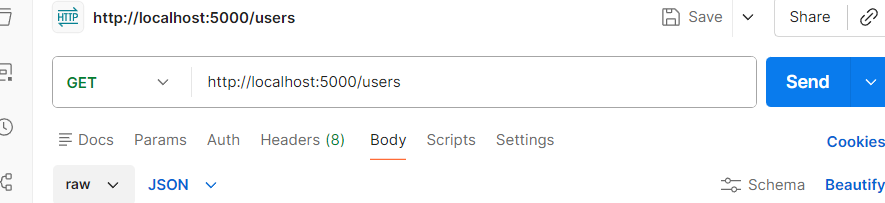
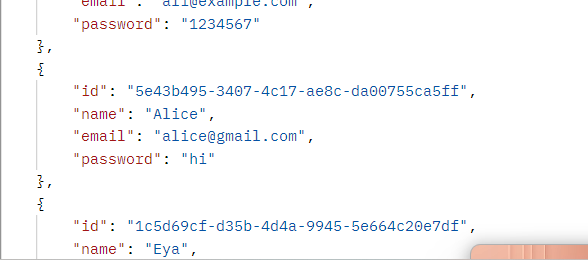

## Tester la mise à jour et la suppression d’un utilisateur avec les deux approches.

- REST

- graphHql
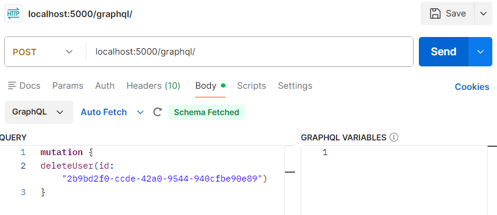
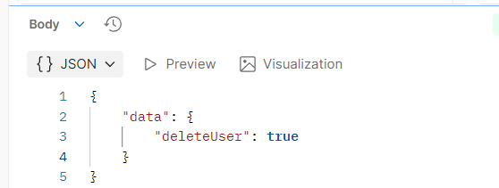

## tester devices :
get devices : 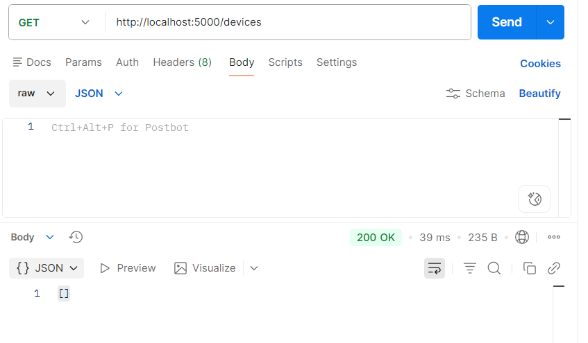
post devices : 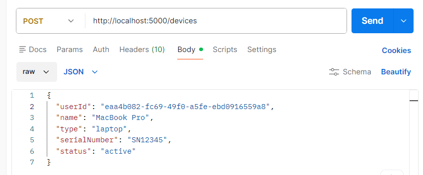
 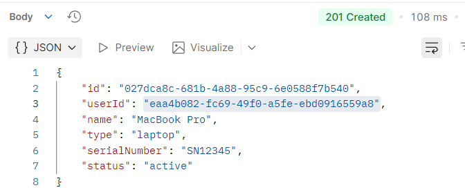
delete device : 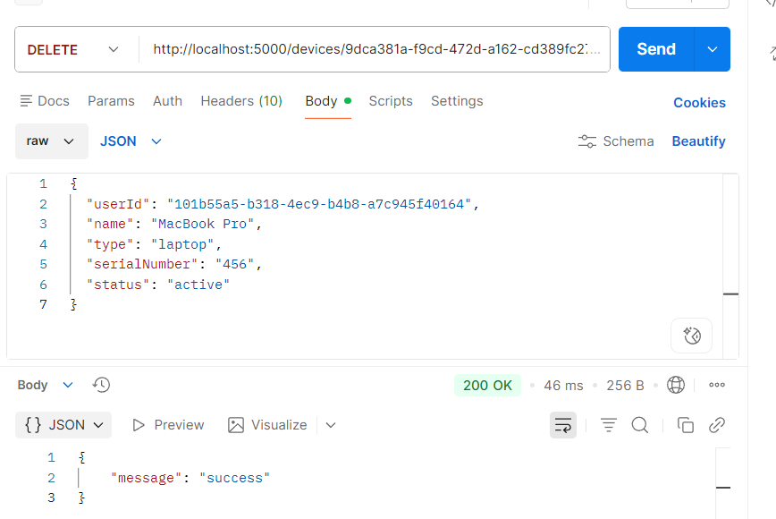
